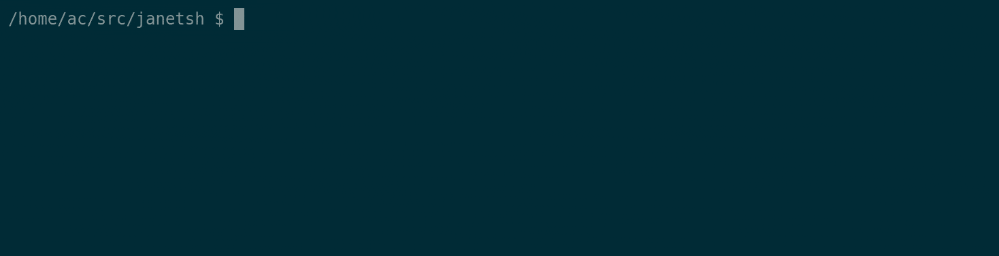

# Janetsh 

[](https://gitter.im/janetsh/community?utm_source=badge&utm_medium=badge&utm_campaign=pr-badge)
[Mailing list](https://lists.sr.ht/~ach/janetsh)
[Help develop janetsh, donate via paypal](https://www.paypal.com/cgi-bin/webscr?cmd=_s-xclick&hosted_button_id=Y3SWVCXV3PEA6&source=url)

A new system shell that uses the [Janet](https://janet-lang.org/) programming language
for high level scripting while also supporting the things we love about sh.

Minimal knowledge of janet is required for basic shell usage,
but know that as you become more familiar with janet, your shell will gain the power of:

- A powerful standard library.
- Functional and imperative programming.
- Powerful lisp macros.
- Runtime loadable extension modules written in C/C++/rust/zig...
- Coroutines and exceptions.
- Much much more.


# See it in action



[demo source code](./demos/demos.janet)

# Examples

## Basic shell usage

As you would expect:
```
$ ls -la | head -n 3
total 100
drwxr-xr-x 1 ac users   220 May 13 20:16 .
drwxr-xr-x 1 ac users   760 May 12 21:08 ..
0

$ echo foo > /dev/null
0

$ sleep 5 &
@{:pgid 82190 :procs @[@{:args @[@["sleep"] "5"]
      :pid 82190
      :stopped false
      :redirs @[]}]}

$ rm ./demos/*.gif
0
```

## Functional programming

```
$ (map string/ascii-upper ["functional" "programming"])
@["FUNCTIONAL" "PROGRAMMING"]

$ (defn lines [s] (string/split "\n" s))
<function lines>

$ (lines ($$ ls | head -n 3))
@["build.sh" "demos" "janetsh" ""]

$ echo (reduce + 0 [1 2 3])
6
0
```

## Command capture

```
$ (string/ascii-upper ($$ echo command string capture))
"COMMAND STRING CAPTURE\n"

$ (if (= 0 ($? touch /tmp/test.txt)) (print "success"))
success
nil
```

## Subshells

```
$ ls | head -n 3 | (out-lines string/ascii-upper)
BUILD.SH
DEMOS
JANETSH
0
```

## Exceptions/Errors

```
$ (try
    (do
      ($ rm foo.txt)
      ($ rm bar.txt)
      ($ rm baz.txt))
    ([err] (print "got an error:" err)))
```

# Reference Documentation

Hopefully in the future this sparse reference set will become more polished, but for now
the following snippets may help advanced users play with the shell in it's current state.

## RC file

Janetsh loads ```~/.janetsh.rc``` at startup in interactive mode, which can be used to provide
extra functions, change the prompt function ```*get-prompt*``` and change the completion function
```*get-completion*```.

## History file

Janetsh stores terminal history in ```~/.janetsh.hist```.

## Job control

A list of running jobs can be found in the variable sh/jobs, each
of which is a janet table containing the current state of a user job/pipeline.

The sh package has some functions for manipulating jobs, such
as putting them in the foreground, or terminating them. This
is not a stable interface for now, so you will need to read the code yourself
for documentation.

Some examples:

```
vim
...
Ctrl+Z
$ (sh/make-job-fg (first sh/jobs))
...
Ctrl+Z
$ sleep 60 &
$ (sh/terminate-all-jobs)
```

# Installation

You will need janet installed on your system, then you can run:

```
./configure && make
```

Try ```./configure --help``` for a list of options.

# Janetsh Internals

Internally janetsh is implemented as a low level C library for the janet programming
language, a janet library and a small launcher that does some necessary setup/teardown.

The janet main implementation is a set of janet functions and macros that perform shell
job control, control user input and manage your command pipelines.

At the highest level the user is presented with an
interactive repl interface which implicitly invokes a janet macro
to give janet the familiar sh syntax. You can escape this implicit
macro by prefixing a line with '(' which reverts to regular janet mode.

Technically janetsh can be used as a plain janet library, but some care is required as the library
deals with some global resources such as signal handlers and terminals which cannot be shared within
a program.

# Project Status and Donations

The project is at the proof of concept phase and is only
usable by people brave and willing to fix things for
themselves.

The author would love donations or help from fellow developers to keep things going forward.
Donations will go towards living expenses while developing janetsh and providing upstream support for
the janet programming language issues that affect Janetsh.


This project takes considerable time an effort, please [donate here via paypal](https://www.paypal.com/cgi-bin/webscr?cmd=_s-xclick&hosted_button_id=Y3SWVCXV3PEA6&source=url) to keep the project alive.

At your request with each donation leave a message and if appropriate, it will be included below.

# Sponsors

You - Your message

# Authors

This project is being built with care by Andrew Chambers.

# Thanks

Special thanks to Calvin Rose for creating the Janet programming language.

Thanks to the authors of [closh](https://github.com/dundalek/closh), [rash](https://rash-lang.org/)
and [xonsh](https://github.com/xonsh/xonsh) for providing inspiration for the project.
